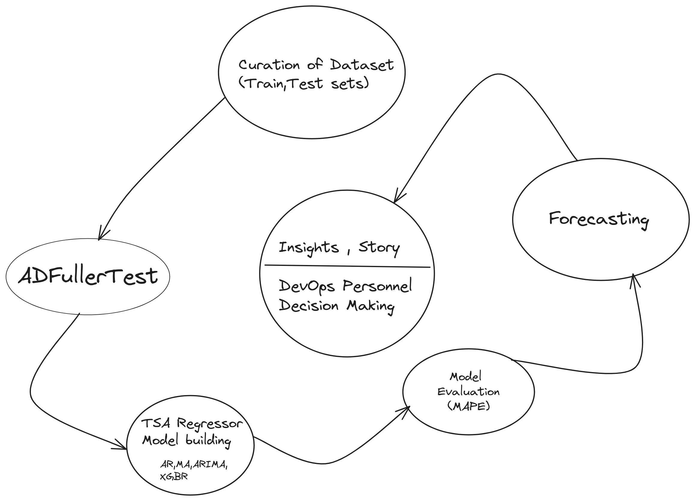

# Prediciting Potential Downtime of DevOps Resources

A Time Series Analyis Approach to solve DevOps, cloud personnel problems and forecast future stories.

## Approach

Curated a dataset from random functions under a probability distribution.
This is the historic train data that we are going to use for the models.

Took a sample feature and modelled it under a timeseries model.
(Note: the feature can be changed , for instance I took container_metrics)

After Forecasting the data, the DevOps Personnel of the company could take note of the predicted values and map the date,time,hour value to ensure to allocate resources which would avoid the potential downtime.