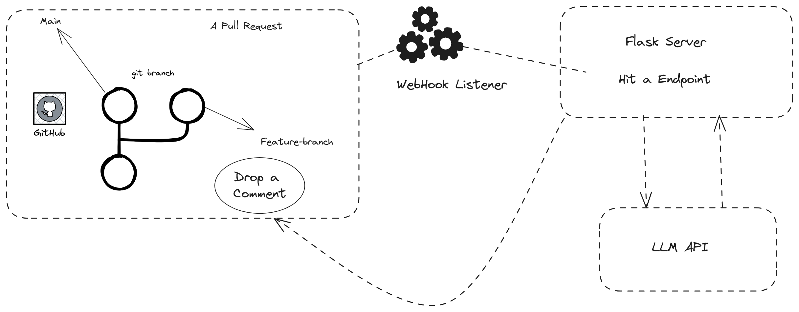

# Cookr-Hack

This is the Repository of PSG TECH Cookr' Hackathon 2024 Submission, by DynamicDisasters.

## Table of Contents

- [Introduction](#introduction)
- [Approach and Directions](#approach-and-directions)
- [ElizaReview](#elizareview)
- [MVP-Features](#mvp-features)
- [Usage](#usage)
- [How It Works](#how-it-works)

## Introduction

The approached problems in chronological order are 4,2,3.

The repository contains the attempts made while solving the problems and some presentation slides magnifying the depth of the problem as well.

Every approach and assumptions made while solving the problems in this hack is documented.

## Approach and Directions

Initial problem that was attempted to solve was the 4th one. 

To read more about the 4th problem's solution please continue reading.

To know about the approaches of 3rd or the 2nd problem navigate to the directories (Problem3, VRP) respectively.

## ElizaReview

ElizaReview is your code review companion, automated to give instant insights on the feature changes that are about to be merged posted as a PullRequest.

ElizaReview is a publicly available and ready to be installed GitHub Software.

## MVP Features

The minimum viable product ElizaReview does the following things (Beta Version):
- Gives insight on a PullRequest of the repo in which ElizaReview is installed.
- Identifies vulnerabilities and code smells
- Provides summary of the code changes.
- App is available to the public globally.

Limitations in Current Beta version:
- Flask Server and Webhook payload listener is run from the developer's local machines only.
- Cannot process big branch diffs say (+500, -376)
- Only usable in public Github Repositories yet.

## Usage

Go to https://github.com/apps/elizareview and hit install on your desired repositories.

Once the Webhook payload service listener, Flask Server is run in local ElizaReview must be usable :)

## How It Works

## EasterEggs

Name - [Eliza](https://en.wikipedia.org/wiki/ELIZA) was the first ever attempt in making a conversational program like LLM.

Logo - WindowsXP search puppy ;)

