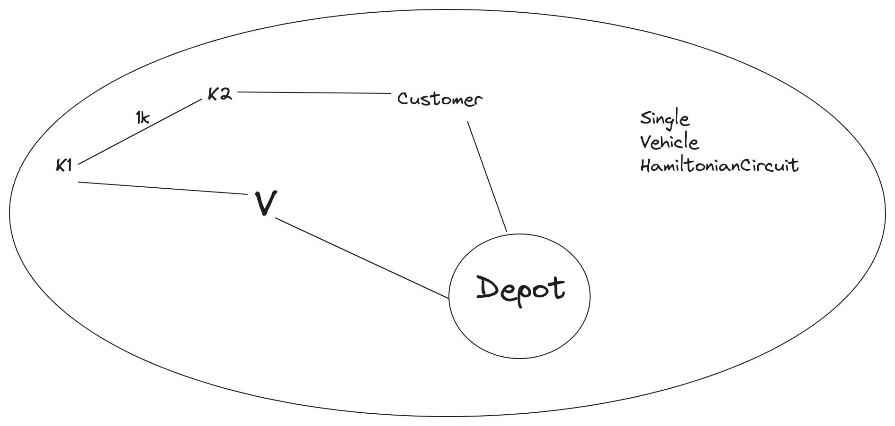

# Last Mile Delivery Problem

We approached this problem by modelling it as a VRP (Vehicle Routing Problem).

Which is a special case of a TSP (Travelling Salesman Problem) but done for 'N' vehicles.

-for Instance (sce 1)

After modelling the problem , we use Google-ORTools solver to solve the modelled problem which would render a no-solution/ Kernel crash.

The step by step story of dataset curation and Operational Research Approach is documented in PPT as slides and in Jupyter Notebook files.

With this knowledge and feasibility study, we moved on to solve the 3rd one.

